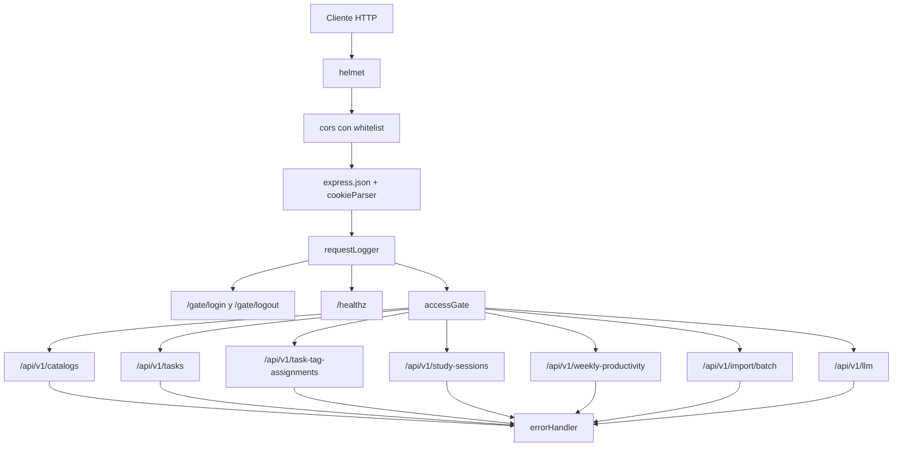

# Aplicacion Express

## Introduccion

El modulo `src/app.js` configura la aplicacion Express que sirve como backend HTTP de Study Task Insights. Define los middlewares globales, montaje de rutas y manejo de errores. El arranque (binding al puerto) queda en `src/server.js`; este archivo solo describe la app.

## Responsabilidades

- Endurecer el servidor con `helmet` (CSP desactivada para no romper el CDN; `crossOriginResourcePolicy: cross-origin`).
- Habilitar `trust proxy` para respetar `X-Forwarded-Proto` cuando esta detras de Cloudflare.
- Configurar CORS con whitelist explicita desde `ALLOWED_ORIGINS` (separados por coma) y `credentials: true`.
- Parseo de JSON (`limit: 1mb`) y cookies firmadas (`cookie-parser`).
- Logging de peticiones (`requestLogger`) con `requestId` por peticion.
- Montar el gate (`/gate`) **antes** del middleware `accessGate` para que `login`/`logout` queden libres.
- Montar `/healthz` antes del `accessGate` para no proteger el healthcheck.
- Aplicar `accessGate` global y montar todas las rutas de negocio bajo `/api/v1/*`.
- Registrar `errorHandler` al final.

## Orden de middlewares



## Configuracion de seguridad

```js
app.disable("x-powered-by");
app.set("trust proxy", 1);

app.use(helmet({
  contentSecurityPolicy: false,
  crossOriginResourcePolicy: { policy: "cross-origin" },
}));
```

`trust proxy: 1` es esencial cuando el backend esta detras de Cloudflare Tunnel: la conexion TCP que ve Express viene de localhost (cloudflared), pero la peticion original es HTTPS. Sin `trust proxy`, las cookies marcadas como `Secure` no se emiten y el gate cross-site falla.

## CORS

```js
const allowedOrigins = (process.env.ALLOWED_ORIGINS ?? "")
  .split(",").map((o) => o.trim()).filter(Boolean);

app.use(cors({
  origin: (origin, cb) => {
    if (!origin || allowedOrigins.includes(origin)) return cb(null, true);
    cb(new Error(`CORS: origin not allowed — ${origin}`));
  },
  credentials: true,
}));
```

Comportamiento:

- Sin `Origin` (curl, herramientas server-to-server): permitido.
- Con `Origin` dentro de la whitelist: permitido.
- Cualquier otro: rechazado con error explicito.

`ALLOWED_ORIGINS` admite multiples valores separados por coma. Para escenario Cloudflare Tunnel debe incluir tanto el origen local de desarrollo como el publico (`https://sti-web.josuesay.com`).

## Endpoints publicos (fuera del gate)

| Metodo | Ruta | Proposito |
| --- | --- | --- |
| `POST` | `/gate/login` | Inicia sesion contra el gate; emite cookie `stia_session` |
| `POST` | `/gate/logout` | Borra la cookie |
| `GET` | `/healthz` | Estado del servicio (uptime, NODE_ENV, timestamp) |

## Endpoints protegidos (`/api/v1/*`)

Todos pasan por `accessGate`. El gate solo aplica si `ACCESS_ENABLED=true`; en caso contrario es un passthrough.

| Prefijo | Modulo |
| --- | --- |
| `/api/v1/catalogs` | `catalogsRoutes` |
| `/api/v1/tasks` | `tasksRoutes` |
| `/api/v1/task-tag-assignments` | `taskTagAssignmentsRoutes` |
| `/api/v1/study-sessions` | `studySessionsRoutes` |
| `/api/v1/weekly-productivity` | `weeklyProductivityRoutes` |
| `/api/v1/import/batch` | `batchImportRoutes` |
| `/api/v1/llm` | `llmRoutes` |

## Manejo de errores

El `errorHandler` final convierte cualquier excepcion (incluida la del CORS callback) en una respuesta JSON con el contrato uniforme (`code`, `message`, opcionalmente `meta`). Detalle en `middlewares/errorHandler.md`.

## Dependencias internas

- `#middlewares/accessGate.js` — validacion del gate (cookie `stia_session` o header `x-access-token`).
- `#middlewares/logger.js` — `requestLogger` con `requestId` (uuidv4) propagado a la respuesta.
- `#middlewares/errorHandler.js` — handler global con respuestas uniformes.
- `#routes/*` — modulos de rutas por dominio.

## Variables de entorno relevantes

| Variable | Efecto |
| --- | --- |
| `ALLOWED_ORIGINS` | Whitelist CORS (lista separada por coma) |
| `ACCESS_ENABLED` | Activa o desactiva el `accessGate` global |
| `COOKIE_CROSS_SITE` | Lo lee `gateController` para emitir `SameSite=None; Secure` (escenario CF) |
| `NODE_ENV` | Influye en flags de seguridad de cookies y en el payload de `/healthz` |
