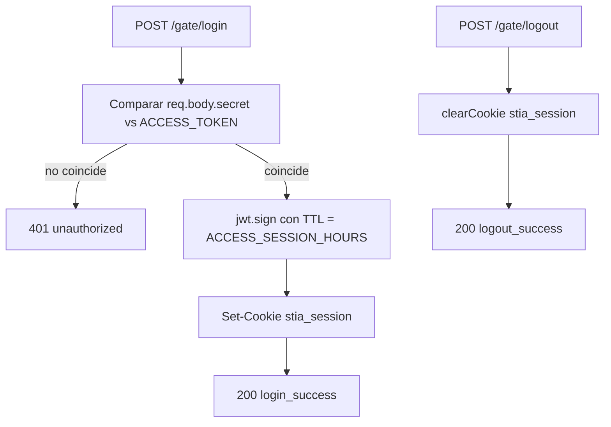

# Controller: gateController.js

## Introduccion

Controlador del gate de acceso. Maneja `POST /gate/login` y `POST /gate/logout`. Es el unico modulo que conoce los detalles de emision/limpieza de la cookie `stia_session`. La validacion en cada request entrante esta en `middlewares/accessGate.js`.

## Funciones expuestas

- `login(req, res)` — autentica con el secreto compartido (`ACCESS_TOKEN`), firma un JWT con HS256 y emite la cookie `stia_session`. Comparacion en tiempo constante con `crypto.timingSafeEqual` para evitar timing attacks.
- `logout(req, res)` — limpia la cookie con las mismas opciones que se usaron al emitirla.

## Diagrama



## Cookie `stia_session`

`cookieOpts(req)` calcula los atributos en cada peticion:

| Atributo | Valor |
| --- | --- |
| `httpOnly` | `true` |
| `secure` | `true` si `req.secure` o `X-Forwarded-Proto: https` (lo da Cloudflare gracias a `trust proxy: 1`) |
| `sameSite` | `none` si `COOKIE_CROSS_SITE=true`, `lax` en caso contrario |
| `path` | `/` |
| `maxAge` | `ACCESS_SESSION_HOURS * 3600 * 1000` |

`SameSite=None` exige `Secure=true`. Por eso, en escenario Cloudflare Tunnel cross-site, hace falta:

- `COOKIE_CROSS_SITE=true`.
- Backend detras de HTTPS (cloudflared termina TLS en el edge y propaga `X-Forwarded-Proto`).
- `app.set("trust proxy", 1)` en `app.js` para que Express considere segura la peticion.

## Comparacion segura

```js
const expectedBuf = Buffer.from(expected ?? "");
const providedBuf = Buffer.from(provided);
const match =
  expectedBuf.length === providedBuf.length &&
  crypto.timingSafeEqual(expectedBuf, providedBuf);
```

Compara longitud antes para evitar lanzar excepcion en `timingSafeEqual` con buffers de tamano distinto, y la comparacion en si es de tiempo constante.

## Respuestas

| Caso | Status | Body |
| --- | --- | --- |
| Login OK | `200` | `{ code: "login_success", message: "Access granted" }` |
| Login fallido | `401` | `{ code: "unauthorized", message: "Invalid credentials" }` |
| Logout | `200` | `{ code: "logout_success", message: "Session closed" }` |

Nota: actualmente `login` y `logout` responden con shape simple (`{code, message}`) en lugar del wrapper de `utils/response.js`. Es deliberado para mantener las respuestas del gate breves y sin metadata.

## Variables relevantes

| Variable | Uso |
| --- | --- |
| `ACCESS_TOKEN` | Secreto compartido. Se usa tanto como expected value como secret de firma JWT |
| `ACCESS_SESSION_HOURS` | TTL del JWT y de la cookie (default `8` cuando no se define) |
| `COOKIE_CROSS_SITE` | Decide `sameSite` |

## Dependencias

- `jsonwebtoken` para firma del JWT.
- `crypto` (Node) para `timingSafeEqual`.
