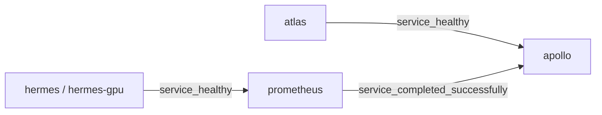

# Docker del backend

## Composicion

`server/docker-compose.yml` define cuatro servicios fijos y uno con dos variantes segun perfil. Todos viven en la red default del compose y se referencian entre si por nombre de servicio.

| Servicio | Contenedor | Perfil | Imagen | Rol |
| --- | --- | --- | --- | --- |
| `atlas` | `sti-atlas` | `cpu`, `gpu` | `postgres:16` | PostgreSQL con esquema `sti` |
| `hermes` | `sti-hermes` | `cpu` | `ollama/ollama:latest` | Servidor LLM en CPU |
| `hermes-gpu` | `sti-hermes-gpu` | `gpu` | `ollama/ollama:latest` | Servidor LLM en GPU NVIDIA |
| `prometheus` | `sti-prometheus` | `cpu`, `gpu` | `ollama/ollama:latest` | Descarga del modelo (one-shot) |
| `apollo` | `sti-apollo` | `cpu`, `gpu` | build local (Dockerfile) | API Express + Prisma |

`hermes` y `hermes-gpu` heredan de un anchor YAML (`x-hermes-base`) que centraliza imagen, volumen, healthcheck y variables de Ollama. `hermes-gpu` agrega:

- `aliases: [hermes]` en la red default — apollo sigue resolviendo `http://hermes:11434` sin cambiar nada.
- `deploy.resources.reservations.devices` con `driver: nvidia` para reservar GPU.

`prometheus` y `apollo` declaran `required: false` en `depends_on` para no quejarse del servicio del perfil inactivo.

## Volumenes nombrados

| Volumen | Montado en | Proposito |
| --- | --- | --- |
| `sti_pgdata` | `atlas:/var/lib/postgresql/data` | Datos de PostgreSQL (sobreviven `down`, no `down -v`) |
| `sti_ollama` | `hermes:/root/.ollama` y `hermes-gpu:/root/.ollama` | Modelos de Ollama compartidos entre ambos perfiles |

Compartir `sti_ollama` permite descargar el modelo una vez en CPU y reutilizarlo en GPU (y viceversa). Tambien implica que **no** se debe inferir contra ambos hermes simultaneamente: el KV cache se corrompe.

## Bind mounts

| Origen | Destino | Servicios |
| --- | --- | --- |
| `./scripts` | `/scripts:ro` | `hermes`, `hermes-gpu`, `prometheus` |
| `./migrations` | `/docker-entrypoint-initdb.d:ro` | `atlas` |

Los archivos en `migrations/` se ejecutan al inicializar la base por primera vez (orden alfabetico):

1. `00_setup_db.sh` — orquestador (lee `SEED_DEMO`).
2. `01_init_schema.sql` — crea esquema `sti` y tablas.
3. `02_seed_catalogs.sql` — siembra catalogos.
4. `03_seed_demo.sql` — datos demo opcionales.

## Healthchecks y dependencias



- `atlas`: `pg_isready` cada 5s.
- `hermes` / `hermes-gpu`: `ollama list` cada 10s con `start_period: 30s`.
- `prometheus`: corre `ollama list` y, si falta `LLM_MODEL`, hace `ollama pull` y termina (`restart: no`).
- `apollo`: solo arranca cuando `atlas` esta `healthy` y `prometheus` termino con exito.

## Dockerfile de `apollo`

`server/Dockerfile` usa multi-stage para mantener la imagen final ligera:

| Stage | Base | Proposito |
| --- | --- | --- |
| `base` | `node:22-bookworm-slim` | `NODE_ENV=production`, habilita `corepack` |
| `deps` | `base` | `pnpm install --frozen-lockfile` |
| `build` | `deps` | Copia `prisma/` y corre `prisma generate` |
| `runner` | `base` | Copia `node_modules` de `deps`, codigo de la app y `generated/` de `build`. Expone `3000` y arranca `node src/server.js` |

`pnpm` viene de `corepack`, evitando una dependencia adicional. Solo el directorio `generated/` (Prisma Client generado) viaja desde `build` al `runner`; el resto es `node_modules` ya instalado.

## Comandos habituales

Desde la raiz del repo (recomendado, usa `Makefile` y scripts):

```bash
make start                    # CPU
./scripts/01_start.sh --gpu   # GPU
make stop
make logs
make status
```

Directo con compose desde `server/`:

```bash
docker compose --profile cpu up -d --build --remove-orphans
docker compose --profile gpu up -d --build --remove-orphans
docker compose logs -f apollo
docker compose --profile cpu down
docker compose down -v        # ademas borra DB y modelos
```

Sin `--profile`, los servicios con perfil declarado no arrancan; quedaria solo lo que tenga ambos perfiles (`atlas`, `prometheus`, `apollo`).

## Variables relevantes para Compose

| Variable | Donde se usa |
| --- | --- |
| `DB_USER`, `DB_PASS`, `DB_NAME` | `atlas` (postgres init) |
| `DB_HOST_PORT` | Puerto host expuesto por `atlas` |
| `SEED_DEMO` | `atlas` (consumido por `00_setup_db.sh`) |
| `OLLAMA_KEEP_ALIVE`, `OLLAMA_NUM_PARALLEL` | `hermes`, `hermes-gpu` |
| `LLM_MODEL` | `prometheus` (decide que descargar) |
| `OLLAMA_URL`, `LLM_*`, `ACCESS_*`, `ALLOWED_ORIGINS`, `NODE_ENV`, `APP_PORT` | `apollo` |

`apollo` usa `env_file: .env` (lee todo) y ademas pasa explicitamente algunas variables en `environment:` para fijar defaults sin tocar `.env`.

## Logging

Todos los servicios usan el anchor `x-logging`:

```yaml
driver: "json-file"
options:
  max-size: "10m"
  max-file: "3"
```

Asi los logs no crecen sin limite.

## Dependencias documentales

- `server/.dockerignore` — exclusiones del contexto de build.
- `server/Dockerfile` — imagen de `apollo`.
- `server/docker-compose.yml` — orquestacion del stack backend.
- `server/migrations/` — scripts de inicializacion de PostgreSQL.
