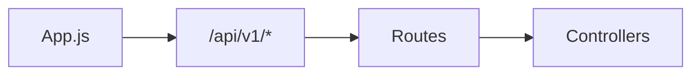

# Routes

## Introducción

Define la **interfaz HTTP pública** del backend: paths, métodos y montaje en `app.js`.

## Contenido

- **tasksRoutes.md**: `/api/v1/tasks`
- **taskTagAssignmentsRoutes.md**: `/api/v1/task-tag-assignments`
- **studySessionsRoutes.md**: `/api/v1/study-sessions`
- **weeklyProductivityRoutes.md**: `/api/v1/weekly-productivity`
- **catalogsRoutes.md**: `/api/v1/catalogs/*`
- **batchImportRoutes.md**: `/api/v1/import/batch`
- **llmRoutes.md**: `/api/v1/llm`

Ademas, el gate vive aparte (no bajo `/api/v1`):

- **gateRoutes.md**: `/gate/login`, `/gate/logout`

## Diagrama

## Convenciones

- Prefijo unico `/api/v1/...` para endpoints de negocio; `/gate` queda fuera del versionado por ser auth previa.
- Nouns en plural (`tasks`, `study-sessions`, `task-tag-assignments`).
- Rutas de negocio protegidas por **accessGate** (montado en `app.js`).
