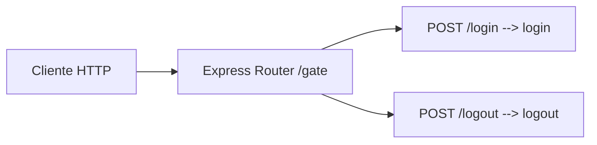

# Routes: gateRoutes.js

## Introduccion

Rutas del gate de acceso. Montadas en `/gate` por `app.js`, **antes** de `accessGate`, para que login y logout queden libres del middleware de proteccion.

## Endpoints

| Metodo | Ruta | Controlador | Descripcion |
| --- | --- | --- | --- |
| `POST` | `/gate/login` | `gateController.login` | Verifica `body.secret` contra `ACCESS_TOKEN`. Emite cookie `stia_session` |
| `POST` | `/gate/logout` | `gateController.logout` | Limpia la cookie `stia_session` |

## Diagrama



## Ejemplos

Login (emite cookie):

```bash
curl -i -X POST http://localhost:3000/gate/login \
  -H "Content-Type: application/json" \
  -d '{"secret":"<ACCESS_TOKEN>"}' \
  -c cookies.txt
```

Respuesta:

```json
{ "code": "login_success", "message": "Access granted" }
```

Y un `Set-Cookie: stia_session=<jwt>; ...` con los atributos calculados por `gateController` (ver doc del controller).

Logout:

```bash
curl -i -X POST http://localhost:3000/gate/logout -b cookies.txt
```

## Cuando esta activo

- Si `ACCESS_ENABLED=false`, el `accessGate` global es passthrough; los endpoints del gate siguen montados pero el resto de `/api/v1/*` ya no exige sesion.
- Si `ACCESS_ENABLED=true`, todo `/api/v1/*` exige cookie valida o header `x-access-token` (ver `middlewares/accessGate.md`).

## Dependencias

- `#controllers/gateController.js` — logica de autenticacion y manejo de cookies.
