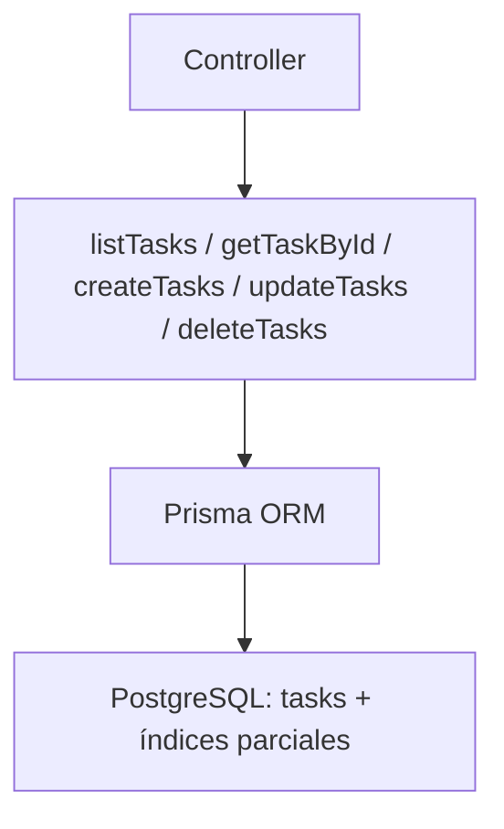

# Service: tasksService.js

## Introducción

Servicio principal para la entidad **`tasks`**, encargado de gestionar el acceso a datos, filtros, validaciones, y relaciones (lookups, etiquetas).  
Implementado con **Prisma ORM**, maneja consultas complejas, errores de unicidad y validaciones de integridad referencial.

## Funciones exportadas

### 🟩 `listTasks(params)`

Lista tareas con soporte para:

- Filtros: `statusId`, `priorityId`, `typeId`, `termId`, `tagId`, `q`, `dueFrom`, `dueTo`, `archived`.
- Paginación (`limit`, `offset`), orden (`orderByField`, `orderByDir`).
- `include=lookups|tags|all`.

**Ejemplo:**

```js
await listTasks({ termId: 1, include: "all", limit: 10 });
```

**Respuesta:**

```json
{ "items": [...], "total": 50 }
```

### 🟩 `getTaskById(taskId, { include })`

Obtiene una tarea por UUID.
Incluye relaciones si se pasa `include=lookups|tags|all`.
Lanza `404` si no existe.

### 🟩 `createTasks(payload)`

Crea una o varias tareas nuevas.

- Limpia campos de solo lectura (`taskId`, `createdAt`, `updatedAt`).
- Usa transacción Prisma (`$transaction`) para atomicidad.
- Manejo de errores:

  - `P2003` → **409 FK inválida.**
  - `P2002` → **409 Duplicado (índice único parcial).**

**Respuesta:**

```json
{
  "count": 2,
  "items": [...]
}
```

### 🟩 `updateTasks(payload)`

Actualiza una o varias tareas existentes.

- Cada registro requiere `taskId`.
- Devuelve objetos actualizados, más listas de errores:

```json
{
  "count": n,
  "items": [...],
  "notFoundIds": [...],
  "conflictIds": [...]
}
```

**Errores manejados:**

- `P2025`: no encontrada.
- `P2002`: conflicto de unicidad.
- `P2003`: violación de FK.

### 🟩 `deleteTasks(ids)`

Elimina una o varias tareas.
Devuelve:

```json
{
  "count": 2,
  "deletedIds": ["..."],
  "notFoundIds": [],
  "blockedIds": []
}
```

**Errores manejados:**

- `P2025`: no encontrada.
- `P2003`: restricción FK (bloqueada).

## Validaciones internas

| Función                 | Propósito                                                 |
| ----------------------- | --------------------------------------------------------- |
| `stripReadOnly()`       | Quita campos inmutables antes de guardar.                 |
| `normalizePagination()` | Aplica límites seguros (`limit ≤ 200`).                   |
| `buildWhere()`          | Crea filtros complejos (`q`, rangos, estado, tags, etc.). |
| `buildInclude()`        | Controla relaciones incluidas (`lookups`, `tags`, `all`). |

## Índices únicos parciales (DB)

Para evitar duplicados de tareas activas:

- `(term_id, lower(btrim(title)), due_at)` cuando `archived_at IS NULL` y `due_at` no es nulo.
- `(term_id, lower(btrim(title)))` cuando `archived_at IS NULL` y `due_at` es nulo.

Esto permite crear nuevas versiones de tareas archivadas sin conflictos.

## Diagrama



## Buenas prácticas

- No actualizar `actualMin` directamente; debe derivarse de `study_sessions`.
- Archivar tareas completadas para liberar restricciones de unicidad.
- Evitar `include=all` en listados grandes (impacto de rendimiento).

## Dependencias

- `#config/prismaClient.js`
- Prisma ORM
- PostgreSQL (índices únicos parciales, FKs)
