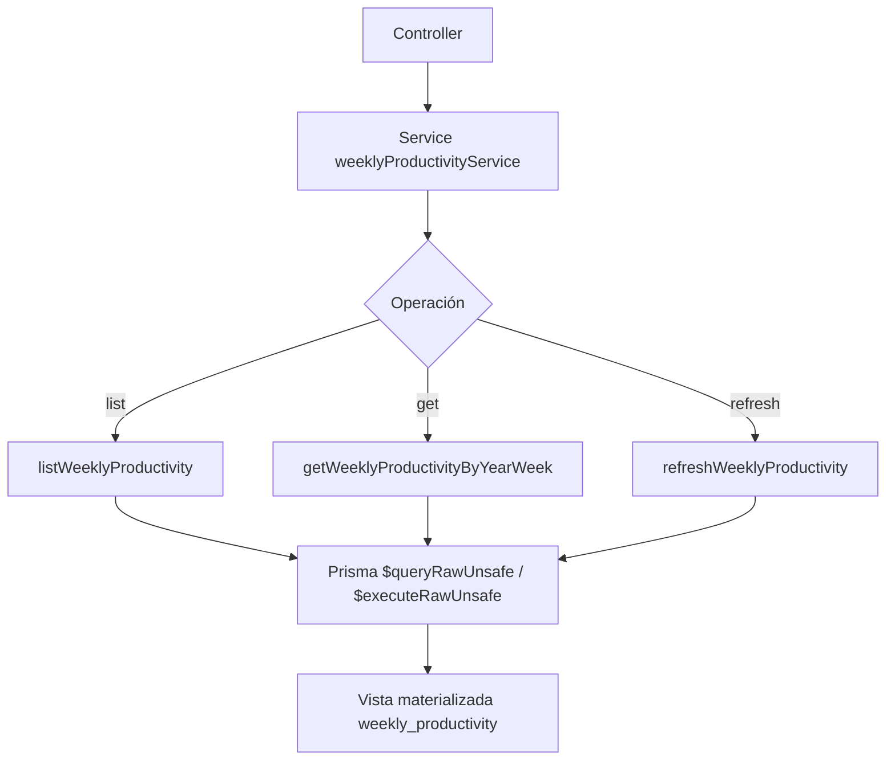

# Service: weeklyProductivityService.js

## Introducción

El servicio `weeklyProductivityService.js` gestiona la lógica de acceso y actualización de la vista materializada `weekly_productivity`.
Utiliza **Prisma ORM** y sentencias SQL seguras (`$queryRawUnsafe`) para operar directamente sobre la vista.

## Descripción general

Este módulo permite:

- Consultar datos de productividad semanal con filtros dinámicos.
- Obtener un registro puntual por año y semana.
- Ejecutar la actualización de la vista para reflejar los últimos datos de `tasks` y `study_sessions`.

## Diagrama de flujo



## Funciones exportadas

### 🟩 `listWeeklyProductivity(params)`

Devuelve una lista paginada de registros semanales.

**Parámetros soportados:**

- `year`, `week`, `yearFrom`, `yearTo`, `weekFrom`, `weekTo`
- `limit`, `offset`, `orderByField`, `orderByDir`

**Retorna:**

```json
{
  "items": [...],
  "total": 10
}
```

### 🟩 `getWeeklyProductivityByYearWeek(isoYear, isoWeek)`

Obtiene un único registro según el año y la semana ISO.
Lanza `404` si no existe coincidencia.

### 🟩 `refreshWeeklyProductivity()`

Ejecuta la actualización de la vista materializada:

- Intenta con `REFRESH MATERIALIZED VIEW CONCURRENTLY`.
- Si falla (por bloqueo o restricción), ejecuta la versión estándar.
- Devuelve:

```json
{
  "ok": true,
  "refreshed": true,
  "at": "2025-11-01T22:18:00.239Z"
}
```

## Validaciones clave

- `limit` máximo: **200** registros.
- Ordenación controlada por lista blanca de campos (`buildOrderBy`).
- Conversión segura de tipos numéricos (`::int`, `::float8`).
- `avg_completion_time_min` se normaliza con `COALESCE(..., 0)` para evitar `null`.

## Dependencias internas

- `#config/prismaClient.js`
- PostgreSQL 16 (vista materializada `weekly_productivity`)
- Prisma ORM (`$queryRawUnsafe`, `$executeRawUnsafe`)
