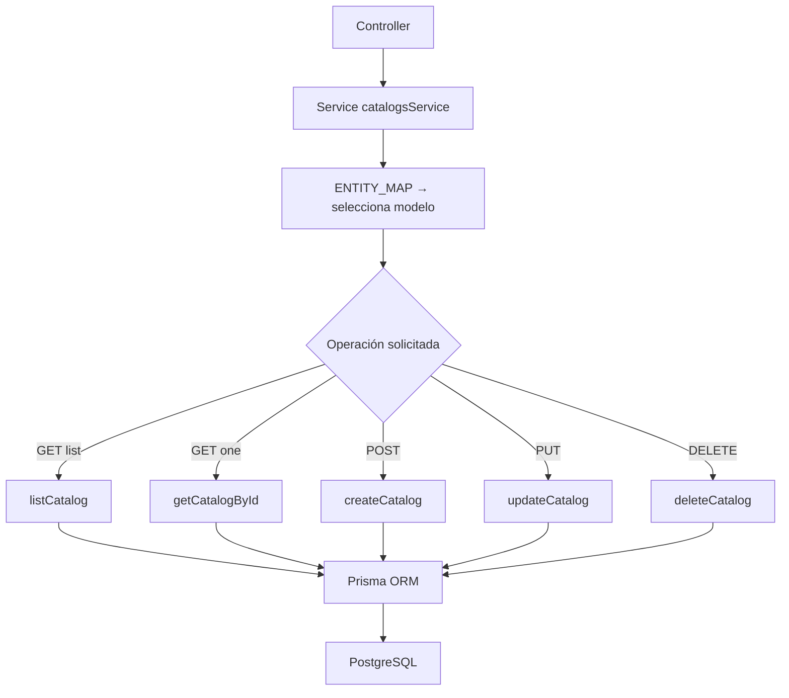

# Service: catalogsService.js

## Introducción

El servicio `catalogsService.js` implementa la lógica de acceso a datos para todos los **catálogos del sistema** (`terms`, `task-statuses`, `task-priorities`, `task-types`, `task-tags`).  
Centraliza las operaciones CRUD utilizando **Prisma ORM**, asegurando consistencia, validaciones y manejo controlado de errores. :contentReference[oaicite:0]{index=0}

## Descripción general

Este módulo abstrae completamente la interacción con la base de datos.  
El controlador (`catalogsController.js`) solo delega la operación al método correspondiente de este servicio. :contentReference[oaicite:1]{index=1}

Cada catálogo está definido en un mapa `ENTITY_MAP`, que indica:

- **modelo Prisma** (`prisma.term`, `prisma.taskStatus`, etc.)
- **campo ID principal** (`termId`, `taskTypeId`, etc.)
- **campos buscables** (`searchableFields`)
- **campos de solo lectura**
- **orden de listado (`orderBy`)**

## Diagrama de flujo



## Funciones exportadas

### 🟩 `ensureEntity(entity)`

Verifica que la entidad exista en el `ENTITY_MAP`.
Si no está definida, lanza un error **400**: `"Catálogo no soportado"`.

### 🟩 `listCatalog(entity, { q, limit, offset })`

Devuelve una lista paginada y opcionalmente filtrada por texto (`q`).

- Genera búsqueda dinámica en campos configurados como `searchableFields`.
- Aplica `limit` y `offset` con límites seguros (máx. 200).
- Retorna:

  ```json
  {
    "items": [...],
    "total": 50
  }
  ```

### 🟩 `getCatalogById(entity, id)`

Obtiene un registro por ID; lanza `404` si no existe.
Valida el tipo de ID (`Number` o `UUID` según entidad).

### 🟩 `createCatalog(entity, payload)`

Crea uno o varios registros nuevos.

- Acepta objeto o arreglo.
- Limpia campos de solo lectura (`stripReadOnly`).
- Usa transacción Prisma (`$transaction`) para retornar los objetos creados.
- Maneja errores:

  - `P2002`: **409 Duplicado**.

### 🟩 `updateCatalog(entity, payload)`

Actualiza uno o varios registros.

- Requiere que cada objeto contenga su ID (`idKey`).
- Omite campos de solo lectura.
- Retorna:

  ```json
  {
    "count": n,
    "items": [...],
    "notFoundIds": [...],
    "conflictIds": [...]
  }
  ```

- Maneja errores:

  - `P2025`: registro no encontrado.
  - `P2002`: conflicto de unicidad.

### 🟩 `deleteCatalog(entity, ids)`

Elimina uno o varios registros.

- Acepta `body.ids` como arreglo o valor único.
- Procesa cada ID individualmente para identificar:

  - `deletedIds` → eliminados
  - `notFoundIds` → no encontrados
  - `blockedIds` → con restricción FK (`P2003`)
- Devuelve:

  ```json
  {
    "count": 2,
    "deletedIds": [1, 2],
    "notFoundIds": [],
    "blockedIds": []
  }
  ```

## Mecanismos auxiliares

| Función                       | Propósito                                          |
| ----------------------------- | -------------------------------------------------- |
| `parseId(entity, raw)`        | Convierte a número o UUID según entidad.           |
| `stripReadOnly(data, fields)` | Elimina campos de solo lectura antes de escritura. |

## Validaciones clave

- Todas las operaciones verifican entidad válida mediante `ensureEntity()`.
- Lanzan errores con `statusCode` (`400`, `404`, `409`).
- No permiten `payload` vacío.
- Búsqueda textual `LIKE` insensible (`mode: "insensitive"`).

## Dependencias internas

- `#config/prismaClient.js`
- Prisma ORM (métodos `findMany`, `create`, `update`, `delete`, `$transaction`)
- PostgreSQL 16 (a través de Prisma)

## Ejemplo de uso (desde un controlador)

```js
import { listCatalog } from "#services/catalogsService.js";

const result = await listCatalog("task-types", { q: "exam", limit: 10 });
console.log(result.items);
```

**Salida:**

```json
{
  "items": [{ "taskTypeId": 1, "code": "exam", "description": "Examen final" }],
  "total": 1
}
```
