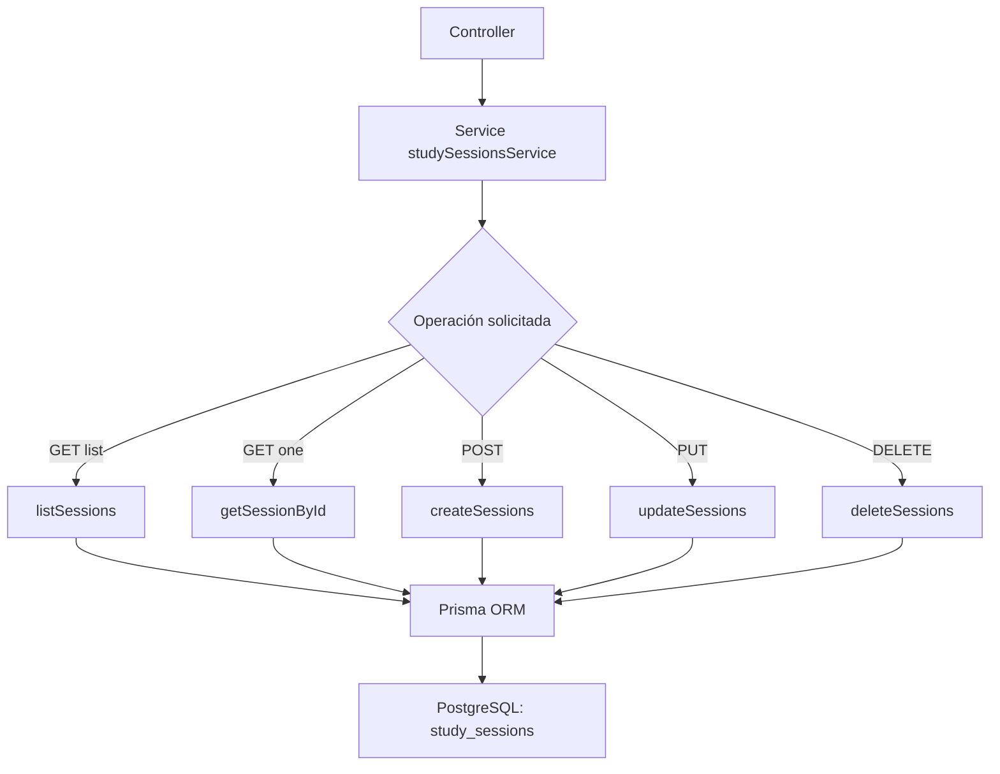

# Service: studySessionsService.js

## Introducción

Servicio de datos para la entidad **`study_sessions`**, encargado de administrar la persistencia y validaciones de sesiones de estudio.  
Implementa las operaciones CRUD con **Prisma ORM**, validando coherencia temporal (`startedAt <= endedAt`) y relaciones (`taskId` válido).

## Descripción general

Cada sesión representa un bloque de tiempo invertido en una tarea específica.  
El campo `durationMinutes` se genera automáticamente por PostgreSQL y se refleja en Prisma mediante `@default(dbgenerated())`.

## Diagrama de flujo



## Funciones exportadas

### 🟩 `listSessions(params)`

Lista sesiones con soporte de filtros (`taskId`, fechas, búsqueda en `notes`), orden y paginación.
Incluye la tarea relacionada si se solicita con `include=task` o `include=all`.

**Retorna:**

```json
{ "items": [...], "total": 10 }
```

### 🟩 `getSessionById(id, { include })`

Obtiene una sesión específica por UUID.
Incluye su tarea si se pasa `include=task|all`.
Lanza `404` si no existe.

### 🟩 `createSessions(payload)`

Crea una o varias sesiones.

- Valida que `startedAt` y `endedAt` existan y sean válidas.
- Limpia campos de solo lectura (`studySessionId`, `createdAt`, `durationMinutes`).
- Usa transacción Prisma (`$transaction`).
- Errores controlados:

  - `P2003`: **409 FK inválida (`taskId` no existente)**.

**Respuesta:**

```json
{
  "count": 2,
  "items": [...]
}
```

### 🟩 `updateSessions(payload)`

Actualiza una o varias sesiones existentes.

- Requiere `studySessionId` por registro.
- Si se actualiza `startedAt` o `endedAt`, valida coherencia temporal.
- Maneja errores:

  - `P2025`: sesión no encontrada.
  - `P2003`: FK inválida (`taskId`).

**Respuesta:**

```json
{
  "count": 1,
  "items": [...],
  "notFoundIds": [],
  "conflictIds": []
}
```

### 🟩 `deleteSessions(ids)`

Elimina una o varias sesiones por ID.
Devuelve conteo, IDs eliminados y no encontrados.

**Ejemplo:**

```json
{
  "count": 2,
  "deletedIds": ["uuid-1", "uuid-2"],
  "notFoundIds": []
}
```

## Mecanismos auxiliares

| Función                 | Propósito                                                      |
| ----------------------- | -------------------------------------------------------------- |
| `stripReadOnly(data)`   | Elimina campos calculados o inmutables antes de escritura.     |
| `ensureValidTimes()`    | Garantiza que `endedAt` ≥ `startedAt`.                         |
| `buildWhere()`          | Crea filtros por rango temporal y búsqueda textual en `notes`. |
| `buildInclude()`        | Permite incluir la relación con `task`.                        |
| `normalizePagination()` | Limita `limit` y `offset` a valores seguros.                   |

## Validaciones clave

- `startedAt` y `endedAt` deben ser fechas válidas (`Date`) y `endedAt ≥ startedAt`.
- `taskId` debe existir en `tasks`.
- Campos `durationMinutes` y `createdAt` no se modifican directamente (solo lectura).

## Dependencias internas

- `#config/prismaClient.js`
- Prisma ORM (`findMany`, `create`, `update`, `delete`, `$transaction`)
- PostgreSQL (cálculo automático de `duration_minutes`)
