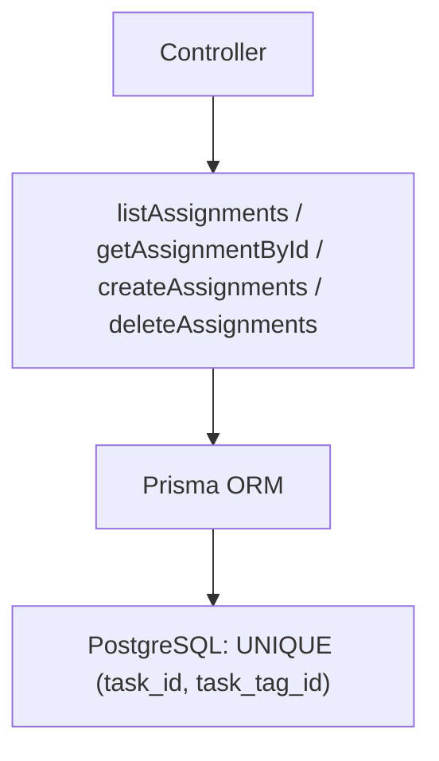

# Service: taskTagAssignmentsService.js

## Introducción

Servicio de datos para la tabla relacional **`task_tag_assignments`**, que implementa la lógica de negocio para enlazar tareas con etiquetas globales.  
Opera sobre Prisma ORM, aplicando validaciones, filtros, paginación y manejo controlado de errores (duplicados y FK).

## Funciones exportadas

### 🟩 `listAssignments(params)`

Devuelve una lista de asignaciones según filtros opcionales (`taskId`, `tagId`), con paginación (`limit`, `offset`), orden (`orderByField`, `orderByDir`) y relaciones (`include`).

**Ejemplo:**

```js
await listAssignments({ taskId: "uuid-task1", include: "tag" });
```

**Respuesta:**

```json
{ "items": [...], "total": 10 }
```

### 🟩 `getAssignmentById(id, { include })`

Obtiene una asignación por su ID con relaciones opcionales (`include=task|tag|all`).
Lanza **404** si no existe.

### 🟩 `createAssignments(payload)`

Crea una o varias asignaciones nuevas.

* Limpia campos de solo lectura (`taskTagAssignmentId`, `createdAt`).
* Requiere `taskId` y `taskTagId`.
* Usa transacción Prisma (`$transaction`) para atomicidad.

**Manejo de errores:**

| Código Prisma | HTTP  | Causa                                                           |
| ------------- | ----- | --------------------------------------------------------------- |
| `P2002`       | `409` | Duplicado (`taskId + taskTagId` ya existe)                      |
| `P2003`       | `409` | Violación de clave foránea (`taskId` o `taskTagId` inexistente) |

### 🟩 `deleteAssignments(ids)`

Elimina una o varias asignaciones por su ID.

* Procesa individualmente cada elemento.
* Devuelve:

```json
{
  "count": 2,
  "deletedIds": ["uuid1","uuid2"],
  "notFoundIds": []
}
```

## Validaciones automáticas

| Validación              | Descripción                                           |
| ----------------------- | ----------------------------------------------------- |
| `stripReadOnly()`       | Quita campos de solo lectura antes de escritura.      |
| `normalizePagination()` | Aplica límites seguros (`limit` ≤ 200, `offset` ≥ 0). |
| `buildInclude()`        | Controla carga relacional (`task`, `tag`, `all`).     |
| `buildWhere()`          | Aplica filtros por `taskId`, `tagId`.                 |

## Diagrama de flujo



## Buenas prácticas asociadas

* Siempre validar que `taskId` y `taskTagId` existan antes de crear la relación (Prisma lo hará, pero mejora UX).
* Si ocurre error `P2002`, informar al usuario que esa etiqueta ya fue asignada a la tarea.
* En listados grandes, limitar `limit ≤ 200` para mantener tiempos de respuesta óptimos.
* Eliminar asignaciones inactivas antes de eliminar tareas o etiquetas referenciadas.

## Dependencias

* `#config/prismaClient.js`
* Prisma ORM (`findMany`, `create`, `delete`, `$transaction`)
* PostgreSQL 16 con restricción única `(task_id, task_tag_id)`
